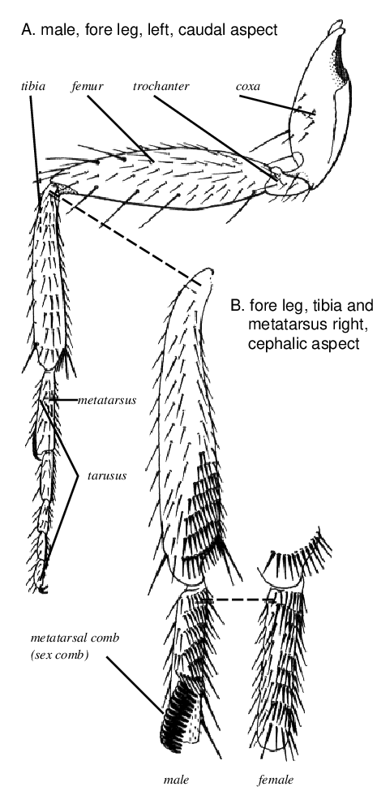
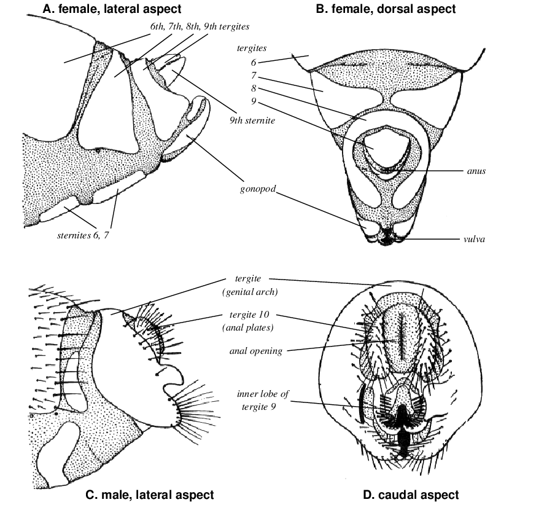

## Culture vessels

For rearing mass cultures, milk bottles with a volume of about 200 ml are useful. About 40 ml of medium is used in a milk bottle. For the progeny from a small number of parental flies glass vials with a volume of 50 ml (medium size) may be used. In medium vials, containing about 10 ml medium, progenies of up to 200 individuals may be produced. For the progeny of single pair matings glass vials with a volume 30 ml (small size) may be used. In small vials, containing about 7 ml medium, progenies of up to 100 individuals may be produced.

| vial   | volume of medium | number of progeny |
|:-------|:-----------------|:------------------|
| Milk   | 25 ml            |               500 |
| Medium | 10 ml            |               200 |
| Small  | 7 ml             |               100 |

## Culture medium

1.  In an ordinary cooking pot, mix together:
    -   1 L water
    -   10 g agar
    -   40 g dry yeast
    -   50 g sucrose
    -   50 g corn meal
    -   50 g malt
2.  Heat to boiling.
3.  Keep boiling gently for approx. 15 min while stirring.
4.  Stop heating and stir in:
    -   10 ml 10% propyl-p-hydroxy-benzoate in ethanol (Nipagin)
    -   5 ml propionic acid
5.  Pour while still hot into culture bottles to make a layer about 2 cm thick.
6.  Plug the bottles with cotton bungs.
7.  Leave the vials for over night.
8.  Freshly prepared vials may be used for starting cultures within the next few days.

## Handling of adult flies

In order to examine the flies of various phenotypes used to start new crosses, the live flies are anesthetized with ether gas. The basic principle for the use of ether is to introduce the flies for a short while into a container in which the flies are exposed to ether vapor.

1.  Drop about 2 ml of ether into a washing bottle stuffed with cotton.
2.  Transfer flies into an empty glass vial and plug it with a cotton bung.
3.  Fill the vial with ether vapor from the washing bottle.
4.  After all flies are inactivated, they are left for a further 10--20 seconds.
5.  If the flies are needed later for setting up fresh cultures, the anesthetic period and the thickness of ether vapor have to be controlled carefully, because longer and thick ether exposure will kill them.
6.  When transferring flies into a medium containing vial, lay down the vial until the flies have revived in order to prevent them from sticking to the medium surface.  Anesthetized flies can also be put into a empty vial to revive and the shaken carefully into the food bottle.

## Starting new cultures

When starting new cultures, it is important to be sure that neither the walls of the bottle nor the surface of the medium are wet.

### Labeling

Vials and bottles should be labeled with a piece of paper. Use water-soluble glue because the labels can be soaked off easily.

### Transfer of flies

The easiest way to start new cultures is to shake unanesthetized flies directly from one bottle into a fresh one. First the flies are shaken to the bottom of the bottle, then both bottles are opened, the bottle with the flies is put upside down on the empty one, and then the flies are shaken into the new bottle.  Too many parental flies yield overcrowded cultures with small, slow growing larvae and delayed hatching of F~1~ flies.

### Stock keeping

To propagate normally fertile stocks about 10 to 25 pairs are used per milk bottle. Beginners should count the flies; later on with some experience, the number of flies can be estimated. Remember: Avoid overcrowding. The parental flies should be removed from the bottles after 2 to 3 days. The bottles are kept in an incubator with an evaporating dish at 23 `&#8451;`{=html}.

## Sex differences

For genetic crosses it is mandatory that males and females can be separated from each other without error. Although there are a number of morphological differences between adult females and males, only a few of these can be safely used for the sexing of flies by beginners.

### Sex combs

Put the flies on their backs under the dissecting microscope and inspect the forelegs. Males have a thick tuft of hairs on the proximal segment of the tarsus, the so-called sex comb (see @fig-sexcomb).

{#fig-sexcomb}

The sex comb is a row of about 10 short, thick, black bristles, located near the distal end of the front side of the leg. Females lack such a structure.

### Genitalia and abdominal coloration

The external genitalia in the two sexes are very different (@fig-sexdiff). The differences can only be seen at magnification of 25-fold and higher. The general impression of the male genitalia at lower magnification is a prominent dark structure. Females have 7 abdominal segments.  The dark back edge of every segment is visible in a dorsal or lateral view. Males have only 5 segments. The posterior part of the abdomen appears black, because the last segments are strongly pigmented and form a black region. These characteristics have to be used with caution for the identification of the sexes, because newly hatched individuals have not yet developed the characteristic pigmentation and anesthetized males often extend their abdomens and in this way the coloration of the abdomen appears striped, similar to that of the females.

{#fig-sexdiff}

## Collection of virgins

For many experiments, virgin females which have not yet mated are required. In order to collect virgins, select cultures, preferably 9--10 days old, with dark brown pupae ready to hatch and remove **all** adult flies! Not a single male or female should remain in the culture. Depending on the stock, flies can be collected during the next 8 to 12 hours. At the end of this period, the flies are anesthetized. Under the stereomicroscope, females and males are separated carefully using a fine brush. Now the females are inspected again to make sure that not a single male has been overlooked. The virgins are then kept in culture bottles without males. This allow the females to mature sexually for 2--3 days. When starting crosses, check a last time for the absence of males from the group of virgins used. If a male is found, the entire group of females has to be discarded. The consequences of such errors can be minimized, if only small groups of females are matured together in one container. Since the collection of virgins is the most critical part of a successful *Drosophila* experiment, the individual steps are listed again below:

1.  Before starting the collection of virgins, not a single fly must be left behind in the culture.
2.  The two sexes have to be separated very carefully. The sex combs of the male and the external genitalia are the best characteristics to use for newly hatched flies.
3.  Before moving the females to culture bottles, make sure that not a single male is present.
4.  When starting crosses, check for the absence of males from the group of virgins.

